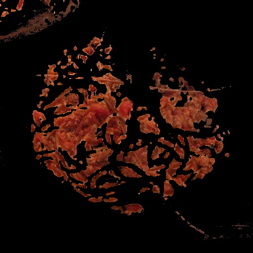

# Computer Vision Image Preprocessing

> OpenCV를 활용한 이미지 전처리 및 색상 검출 프로젝트

## 프로젝트 소개

Computer Vision 기초 기술을 학습하기 위해 OpenCV를 활용한 이미지 전처리 프로젝트를 진행했습니다.

현재 구현된 기능은 빨간색 영역 검출이며, 이후 이미지 전처리 기능(Resize, Grayscale, Blur, Normalize 등)을 순차적으로 추가할 예정입니다.

---

## 개발 환경

- Python 3.9
- OpenCV
- NumPy
- Git / GitHub

---

## 프로젝트 구조

```text
computer-vision-preprocessing
│
├── images
├── results
├── src
│   ├── main.py
│   └── image_processing.py
│
├── README.md
├── requirements.txt
└── .gitignore
```

---

## 구현 기능

- [x] 이미지 로드
- [x] HSV 색상 공간 변환
- [x] 빨간색 영역 검출
- [x] 결과 이미지 저장
- [ ] Resize
- [ ] Grayscale
- [ ] Normalize
- [ ] Blur
- [ ] Data Augmentation

---

## 실행 방법

가상환경 활성화

```bash
.\venv\Scripts\Activate.ps1
```

프로그램 실행

```bash
py src/main.py
```

---

## 실행 결과

### 원본 이미지


### 빨간색 검출 결과



## Update
- Final documentation update