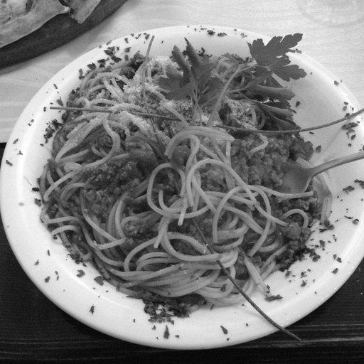
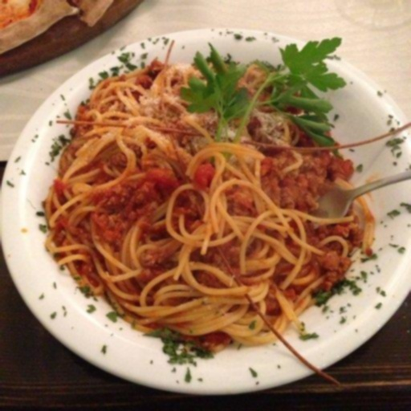
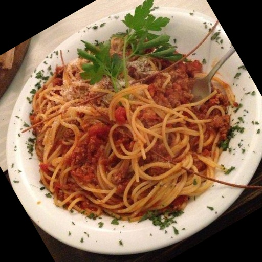
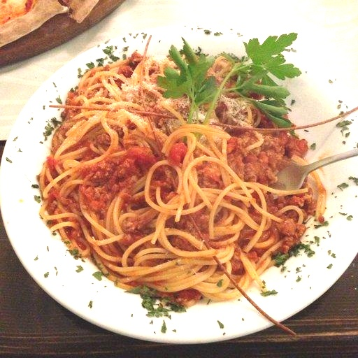

# 🖼️ Computer Vision Image Preprocessing

## 📌 Project Overview

This project implements basic computer vision image preprocessing techniques using **Python** and **OpenCV**.

The project includes image preprocessing, data augmentation, color detection, and simple image quality filtering.

---

## 🛠 Tech Stack

- Python
- OpenCV
- NumPy
- Git
- GitHub

---

## 📂 Project Structure

```
computer-vision-preprocessing
│
├── images
│   └── sample.jpg
│
├── results
│   ├── blur.jpg
│   ├── color_changed.jpg
│   ├── flipped.jpg
│   ├── grayscale.jpg
│   ├── normalized.jpg
│   ├── red_filtered.jpg
│   └── rotated.jpg
│
├── src
│   ├── image_processing.py
│   └── main.py
│
├── README.md
└── requirements.txt
```

---

# ✨ Features

### Image Preprocessing

- Resize (224 × 224)
- Grayscale Conversion
- Image Normalization
- Gaussian Blur

### Data Augmentation

- Horizontal Flip
- Rotation
- Color Augmentation

### Color Detection

- Red Color Detection using HSV Color Space

### Image Quality Filtering

- Dark Image Filtering (Average Brightness)
- Small Object Filtering (Contour Area)

---

# 📷 Results

## Original Image


---

## Grayscale



---

## Blur



---

## Red Color Detection


---

## Rotation



---

## Color Augmentation



---

# 🚀 How to Run

```bash
pip install -r requirements.txt

py src/main.py
```

---

# 📖 What I Learned

- Basic image preprocessing using OpenCV
- Image normalization for AI preprocessing
- Data augmentation techniques
- HSV color space for color detection
- Image quality filtering
- Git Branch & Pull Request workflow

---

# 🔮 Future Improvements

- More color detection
- Additional image augmentation methods
- Performance evaluation using KPI
- Processing multiple images automatically