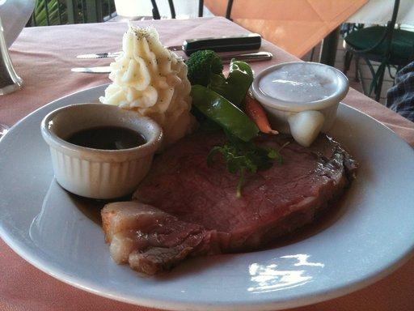
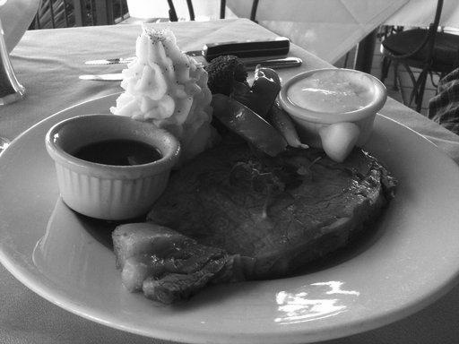
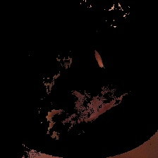
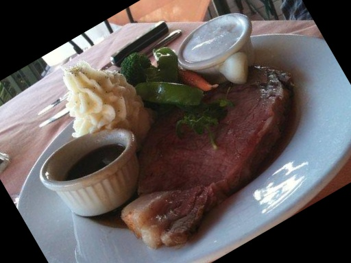
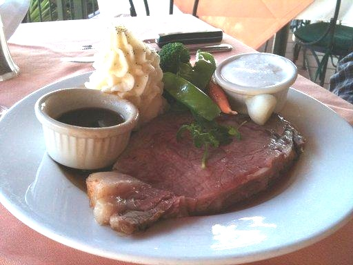

# 🖼️ Computer Vision Image Preprocessing

## 📌 Project Overview

This project implements basic computer vision image preprocessing techniques using **Python** and **OpenCV**.

Five images from the **Hugging Face Food-101 dataset** were used to perform AI image preprocessing, data augmentation, color detection, and image quality filtering.

---

## 🛠 Tech Stack

- Python
- OpenCV
- NumPy
- Git
- GitHub

---

## 📂 Project Structure

```text
computer-vision-preprocessing
│
├── images
│   ├── sample1.jpg
│   ├── sample2.jpg
│   ├── sample3.jpg
│   ├── sample4.jpg
│   └── sample5.jpg
│
├── results
│   ├── sample1
│   ├── sample2
│   ├── sample3
│   ├── sample4
│   └── sample5
│
├── src
│   ├── image_processing.py
│   └── main.py
│
├── README.md
└── requirements.txt
```

---

# ✨ Features

## Image Preprocessing

- Resize (224 × 224)
- Grayscale Conversion
- Image Normalization
- Gaussian Blur

## Data Augmentation

- Horizontal Flip
- Rotation
- Color Augmentation

## Color Detection

- Red Color Detection using HSV Color Space

## Image Quality Filtering

- Dark Image Filtering (Average Brightness)
- Small Object Filtering (Contour Area)

---

# 📷 Results

## Original Image



---

## Grayscale



---

## Blur


---

## Red Color Detection



---

## Rotation



---

## Color Augmentation



---

# 🚀 How to Run

```bash
pip install -r requirements.txt

py src/main.py
```

---

# 📖 What I Learned

- Basic image preprocessing using OpenCV
- Image normalization for AI preprocessing
- Data augmentation techniques
- HSV color space for color detection
- Image quality filtering using brightness and contour area
- Processing multiple images automatically with Python
- Git Branch & Pull Request workflow

---

# 🔮 Future Improvements

- Support additional color detection (Blue, Green, etc.)
- Add more image augmentation techniques
- Measure preprocessing performance using KPI
- Support batch processing for larger image datasets